# Операционная система Unix/Linux.  

## Установка и обновление Linux  

## Contents  
### 1 [Установка ОС](#part-1-установка-ос)  
### 2 [Создание пользователя](#part-2-создание-пользователя)  
### 3 [Настройка сети ОС](#part-3-настройка-сети-ос)  
### 4 [Обновление ОС](#part-4-обновление-ос)  
### 5 [Использование команды  sudo](#part-5-использование-команды-sudo)  
### 6 [Установка и настройка службы времени](#part-6-установка-и-настройка-службы-времени)
### 7 [Установка и использование текстовых редакторов](#part-7-установка-и-использование-текстовых-редакторов)  
### 8 [Установка и базовая настройка сервиса SSHD](#part-8-установка-и-базовая-настройка-сервиса-sshd)  
### 9 [Установка и использование утилит top, htop](#part-9-установка-и-использование-утилит-top-и-htop)
### 10 [Использование утилиты fdisk](#part-10-использование-утилиты-fdisk)
### 11 [Использование утилиты df](#part-11-использование-утилиты-df)
### 12 [Использование утилиты du](#part-12-использование-утилиты-du)
### 13 [Установка и использование утилиты ncdu](#part-13-установка-и-использование-утилиты-ncdu)
### 14 [Работа с системными журналами](#part-14-работа-с-системными-журналами)
### 15 [Использование планировщика заданий CRON](#part-15-использование-планировщика-заданий-cron)

## Part-1-установка-ос
-
    Установка Ubuntu server на виртуальной машине 
1.  Открываем браузер, переходим на https://www.virtualbox.org/, в разделе  Dowloads, скачиваем нужный нам (под нашу оперционную систему) установочный файл, запускаем его и следуем по пунктам установки.  
2.  Создаем "Виртульную машину" (Машина -> Создать).
3.  Загружаем образ нашей операционной системы https://ubuntu.com/ 
4.  Запускаем наш образ в нашей виртульной машине.
5.  Следуя по пунктам меню, выбор языка, настройка сети, прокси, ssh, выбор сервера рипозитория, разметка диска, создание пользователя, выбор приложений для установки.
6. Перезагружаем систему, вводим логин и пароль.
7. Проверка версии ОС :

    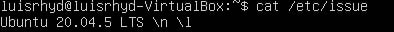  

## Part-2-создание-пользователя
-
    Создание пользователя  
1.  Команда для создания пользователя следущая **sudo useradd опция имя_пользователя** (man useradd)
2.  Команда **sudo** даёт на некоторое время права суперпользователя "root" :  

    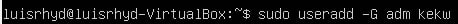 

3.  Пользователь был создан в группе adm, в Linux достаточно много групп пользователей все они различаются определеными правами и доступом к тем или иным ресурсам системы. Группа adm получает доступ к директории /var/log/.
4.  Найти пользователя можно по адресу :

     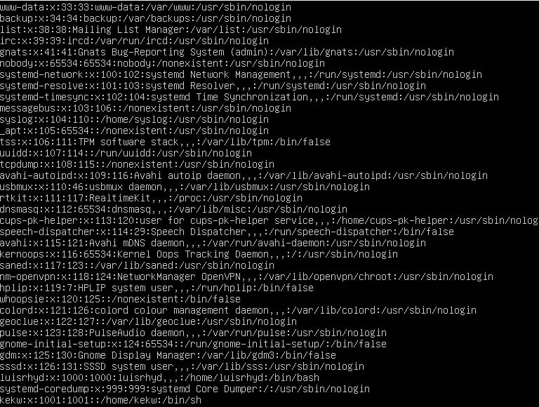  

## Part-3-настройка-сети-ос
-
    Настройка сети
1.  Посмотреть название машаны можно командой **hostnamectl**

    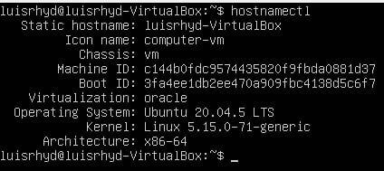  

2.  Задать имя машины, команда (возмно потребуется перезагрузка или команда **systemctl restart systemd-hostnamed**) :

    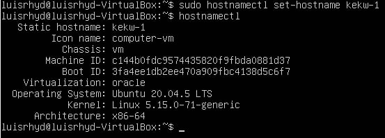 

3.  Установка временной зоны
    1.  Просмотреть системное время можно командой (утилитой) :

    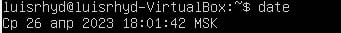 

    2.  Ссылка на системное время и список достуных часовых зон (на что можно поменять): 

    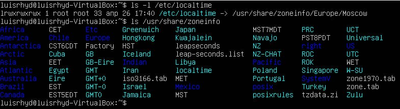

    3.  Удаление старой ссылки на системное время и создание новой :

     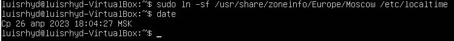

4.  Названия сетевых интерфейсов с помощью консольной команды :
    
    Интерфейсом, является устройство, через которое система получает и передает IP пакеты.
    Есть пара команд для этого, первая **ifconfig**, но на данной версии нашей ОС эта команда
    требует установки специального пакета **sudo apt install net-tools**, после чего :

    

    Вторая команда :

    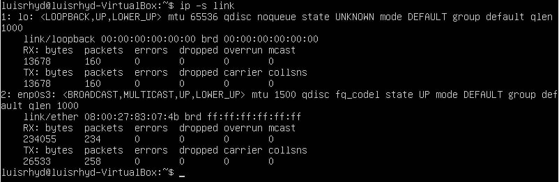

    На скриншотах мы видим параметры нашей Ethernet-карты и "lo" (Local Loopback) кольцевого интерфейса или обратной петли.
    Интерфейс Ethernet при единственной сетевой карте обозначается как enp0s3 или eth0, а кольцевой интерфейс – как lo.
    Если на компьютере, на котором запущен веб-сервер в браузеру ввести  http://127.0.0.1/ или  http://localhost/ то мы попадем на сайт этого компьютера (это и есть "lo").
    Docker был выбран как дополнительное приложение при установке ОС, на скриншотах его параметры.

5.  Консольная команда для получегия ip адреса устройства, от DHCP сервера. 

     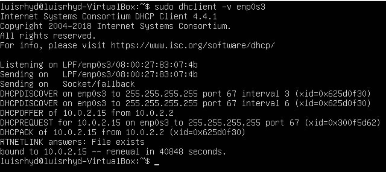

    Сетевые настройки меняются путем редактирования **sudo vim /etc/netplan/00-installer-config.yalm**

    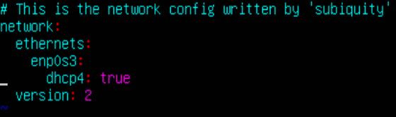

    После чего нужно ввести следующие команды, дабы заработало :

    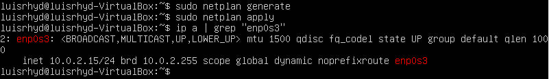
    
    Как мы видим все осталось как было, так как в файле config.yalm DHCP было установлено, как true. DHCP (англ. Dynamic Host Configuration Protocol — протокол динамической настройки узла) — прикладной протокол, позволяющий сетевым устройствам автоматически получать IP-адрес и другие параметры, необходимые для работы в сети TCP/IP.

6.  Определить и вывести на экран внешний ip-адрес шлюза (ip) и внутренний IP-адрес шлюза, он же ip-адрес по умолчанию (gw) возможно следующими способами :
     
    Внешний ip-адрес шлюза

    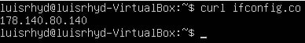

    Внутренний IP-адрес шлюза

    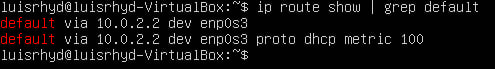

7.  Задать статичные (заданные вручную, а не полученные от DHCP сервера) настройки ip, gw, dns (использовать публичный DNS серверы, например 1.1.1.1 или 8.8.8.8) :

    Опять же редактируем тот самый файл **sudo vim /etc/netplan/00-installer-config.yalm**

    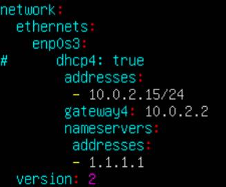

    Далее вводим **sudo netplan generate** затем **reboot**

8.  Перезагрузить виртуальную машину. Убедиться, что статичные сетевые настройки (gw, dns) соответствуют заданным в предыдущем пункте.

    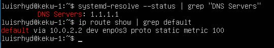

    Пропингуем удаленные хосты 1.1.1.1 и ya.ru

    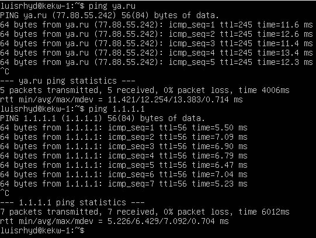

## Part-4-обновление-ос
-
    Обновление системных пакетов

1.  Команда **sudo apt update** обновляет список пакетов. Список пакетов - это файл /etc/apt/sources.list. В этом файле находится все, что мы можем установить в нашей ОС.  

2.  Команда **sudo apt upgrade** обновляет пакеты до последних версий и устанавливает новые пакеты, если они требуются в качестве зависимостей, но не удаляет старые версии или какие-либо помеченные на удаление, а вот **sudo apt full-upgrade** это делает.

    

## Part-5-использование-команды-sudo
-
    Разрешить пользователю, созданному в [Part 2](#part-2-создание-пользователя), выполнять команду sudo.

1. **sudo** (англ. Substitute User and do, дословно «подменить пользователя и выполнить») — программа для системного администрирования UNIX-систем, позволяющая делегировать те или иные привилегированные ресурсы пользователям с ведением протокола работы.  

2. Наделяем пользователя командой **sudo** :

    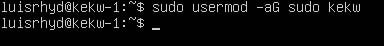

3.  Переключаемся на пользователя и пытаемя поменять имя **hostname**  
    И тут сталкиваемя с проблемой, так как мы не задали пароль для пользователя которого мы создали, мы не можем на него переключиться. Исправляем ситуацию следующей командой **sudo passwd имя_пользователя** и вводим новый пароль, затем подтверждаем его (введя его еще раз). Теперь командой **su имя_пользователя** переключаемя и пытаемя снова поменять имя **hostname**

    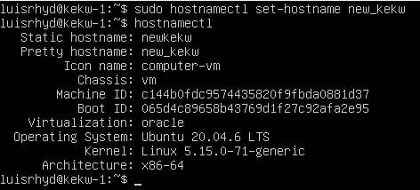

## Part-6-установка-и-настройка-службы-времени
-
    Настроить службу автоматической синхронизации времени.

1.  Во всех операционных Linux системах для этих целей используется **systemd** и так называемый демон **systemd-timesyncd**. Это значит, что у нас уже есть NTP клиент используемый для этих целей (он по умолчанию устанавливается с нашей ОС). Проверить влючена ли синхронизация мы можем командой **timedatectl**

2.  Для настройки синхронизации нам нужно отредактировать файл **vim /etc/systemd/timesyncd.conf** : 

    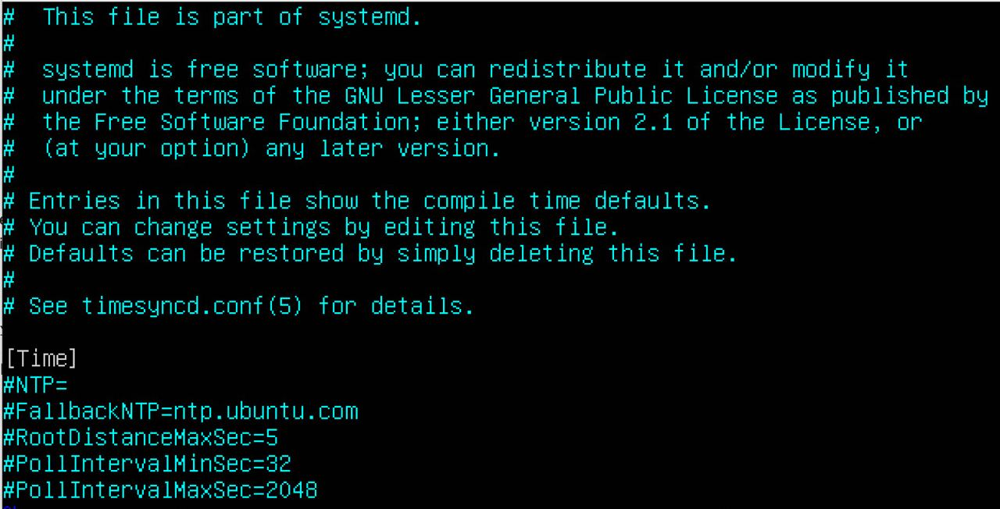

    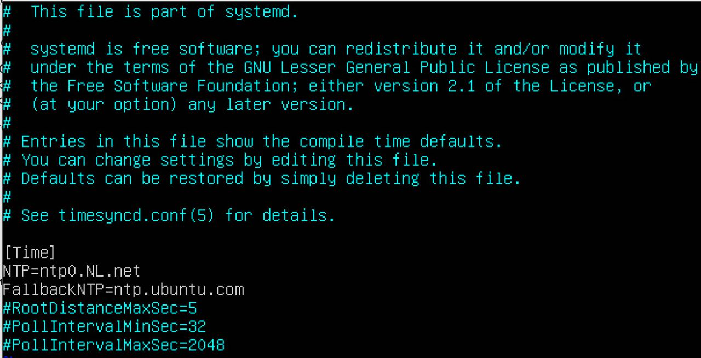

3. Применяем наши изменения и проверяем их :

    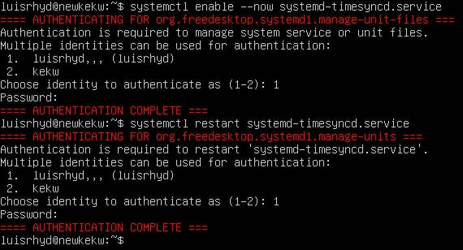

    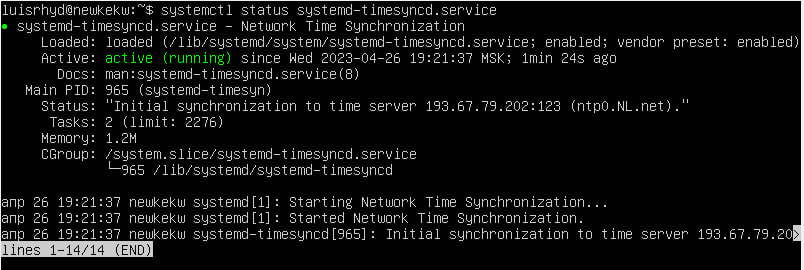

4. Выводим время, часового пояса, в котором мы сейчас находимся :

    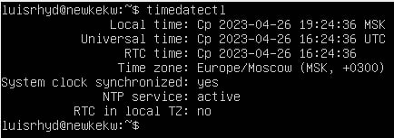

## Part-7-установка-и-использование-текстовых-редакторов
-
    Установка текстового редактора VIM, NANO, MCEDIT.

1. Установить редактор можно командой **sudo apt install vim** и любой другой заменив слово **vim**  

-
    Используя каждый из трех выбранных редакторов, создайте файл test_X.txt, где X -- название редактора, в котором создан файл. Напишите в нём свой никнейм, закройте файл с сохранением изменений

1. ***Vim***  
    1. Создаем файл командой **vim test_vim.txt**
    2. Нажимаем клавишу "i" для ввода
    3. После ввода нажимаем "esc"
    4. Далее следущие клавиши для сохранения и выхода ":wq" и "enter"

    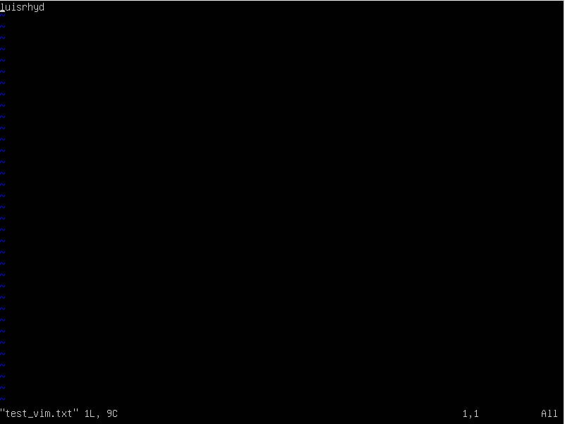

2. ***Nano***  
    1. Создаем файл командой **nano test_nano.txt**
    2. Вводим ник
    3. "ctrl + o" для сохранения ввода, "ctrl + x" для выхода

    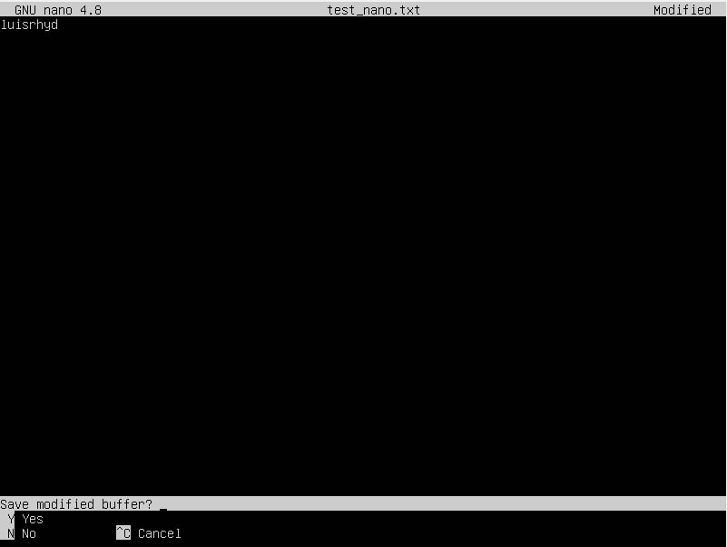

3. ***Mcedit***  
    1. Создаем файл командой **mcedit test_mcedit.txt**
    2. Вводим ник
    3. "f2" для сохранения ввода, "f10" для выхода

    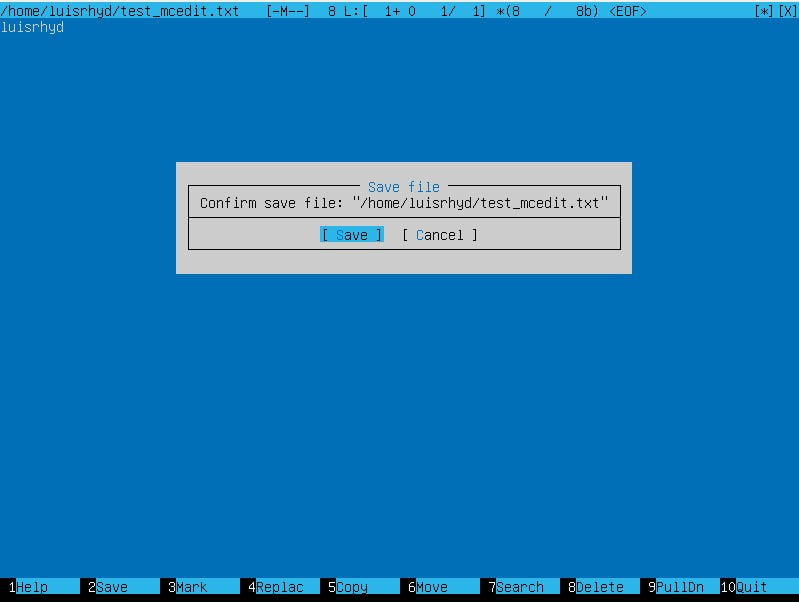

-
    Используя каждый из трех выбранных редакторов, откройте файл на редактирование, отредактируйте файл, заменив никнейм на строку "21 School 21", закройте файл без сохранения изменений.

1. ***Vim***  
    1. Открываем файл **vim test_vim.txt**
    2. Устанавливаем курсор на начало строки, жмем "v"
    3. Стрелочками выделяем слово 
    4. Вводим 
    5. ":q!" для выхода без сохранения 

    

2. ***Nano***  
    1. Открываем файл **nano test_nano.txt**
    2. Устанавливаем курсор на начало строки, жмем "del"
    3. Вводим 
    4. "ctrl + x" и "n" для выхода без сохранения

    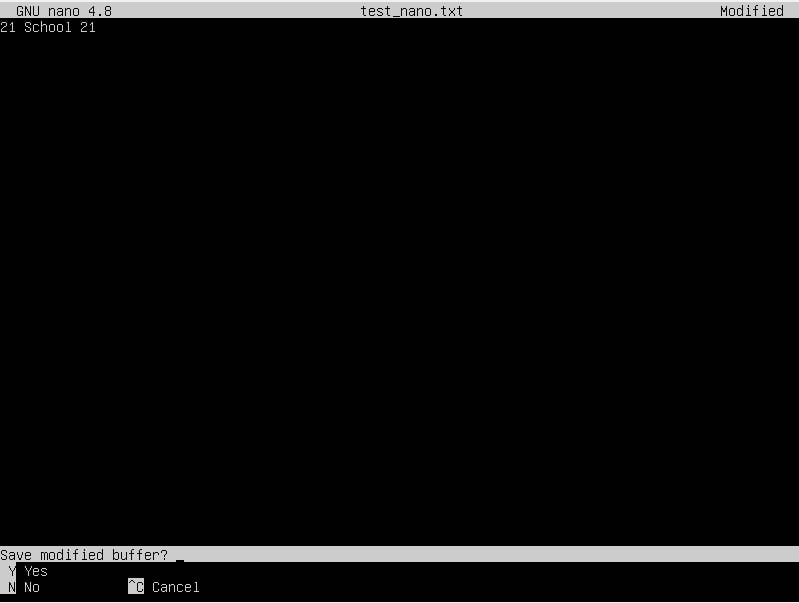

3. ***Mcedit***  
    1. Открываем файл **mcedit test_mcedit.txt**
    2. Устанавливаем курсор на начало строки, жмем "del"
    3. Вводим
    4. "f10" стрелочками выбираем "no"

    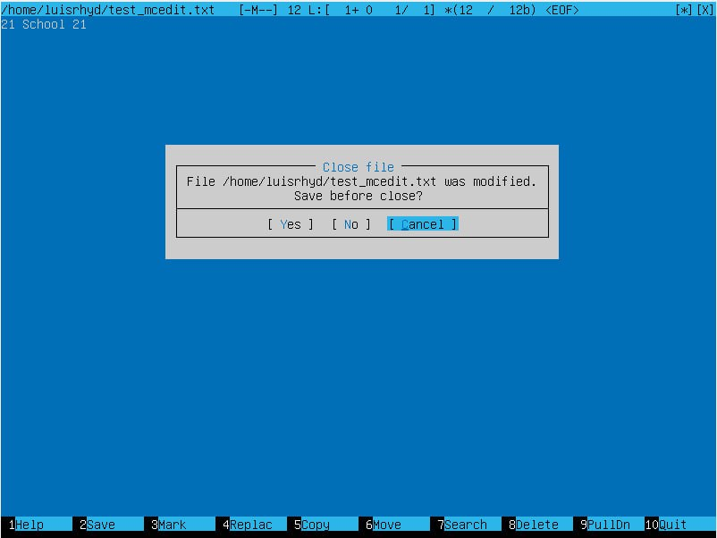

-
    Используя каждый из трех выбранных редакторов, отредактируйте файл ещё раз (по аналогии с предыдущим пунктом), а затем освойте функции поиска по содержимому файла (слово) и замены слова на любое другое.

1. ***Vim***  

    

2. ***Nano***

    1. "alt + r" для поиска с заменой

    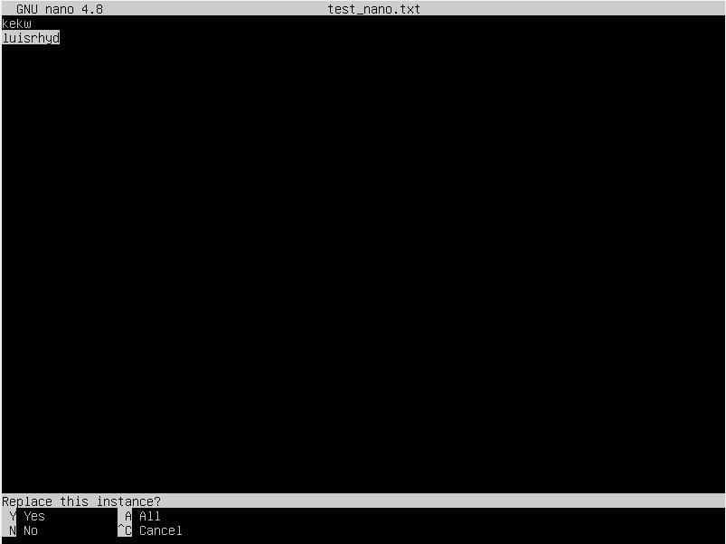

    2. Поиск "сtrl + w", найти следующее вхождение "alt + w" или "ctrl-w" и "enter"

    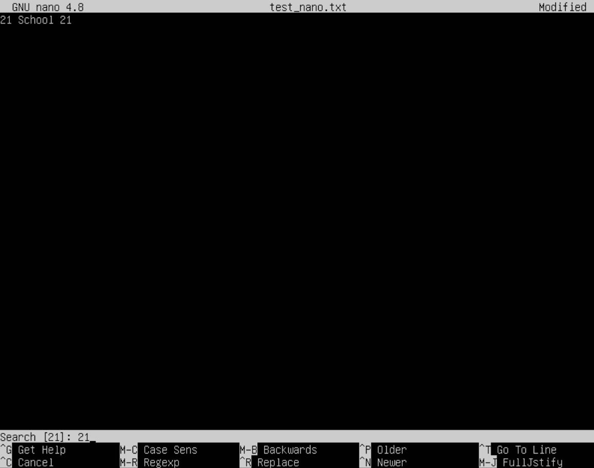

3. ***Mcedit***

    1. Для поиска с заменой нажимаем "f4"

    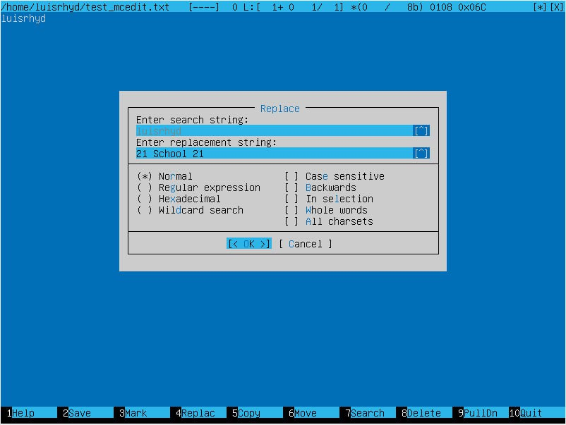

## Part-8-установка-и-базовая-настройка-сервиса-sshd
-
    Установим службу SSHd.  

1. Для установки ssh вводим **sudo apt install openssh-server**
2. Для проверки работает ли ssh :

    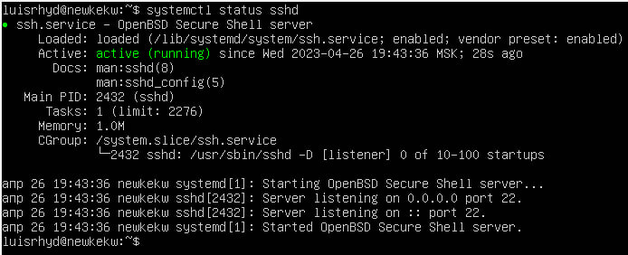  
-
    Добавить автостарт службы при загрузке системы.  

1. Для этого вводим :

    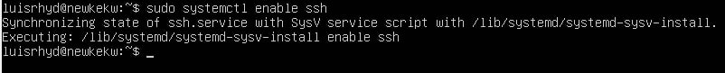  
-
    Перенастроить службу SSHd на порт 2022.  

1. Для изменения и просмотра настроек ssh **sudo mcedit /etc/ssh/sshd_config**

    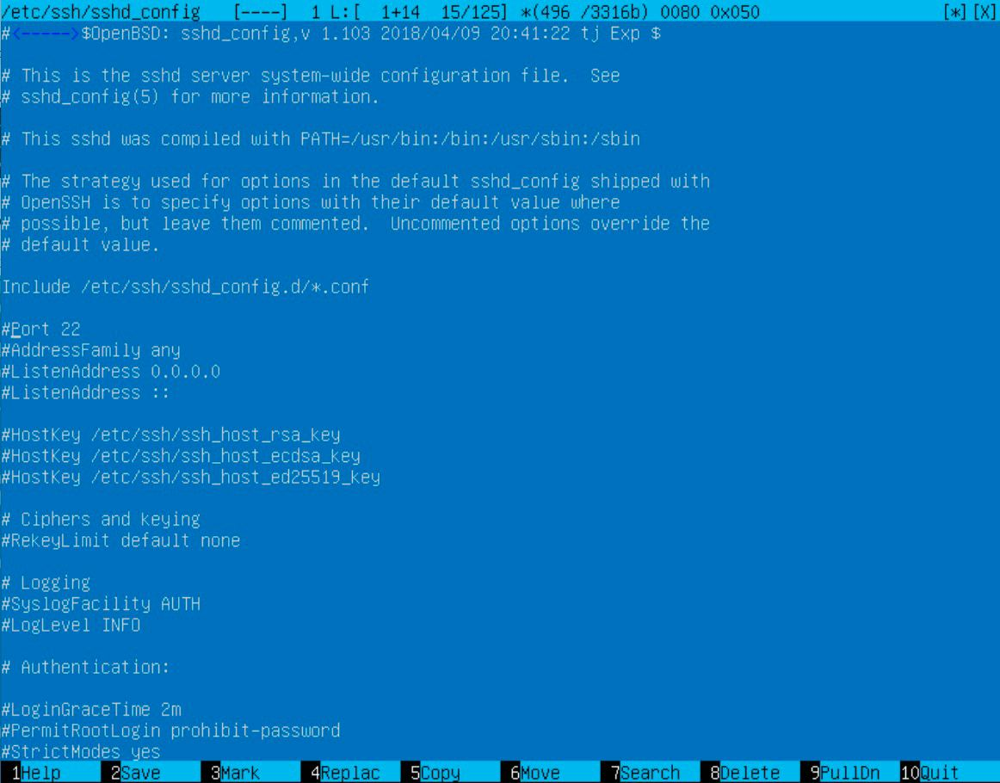  

    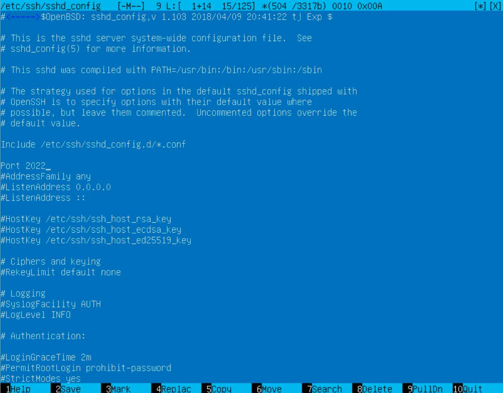  
-
    Используя команду ps, показать наличие процесса sshd. Для этого к команде нужно подобрать ключи.  

1. Для просмотра процессов в Linux используется команда **ps** 
2. Для просмотра оперделенного процесс нужно добавить флаг **-C** и имя самого процесса 

    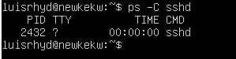  
-
    Перезагрузить систему.

1. Команда **reboot** для перезагрузки
2. Для установки netstat нужно установить пакет, который мы уже установили ранее net-tools **sudo apt install net-tools**
3. Вводим **netstat -tan**

    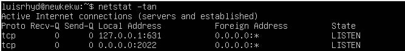 
-
    Значения столбцов вывода.  

1. ***Proto*** Протокол (tcp, udp, raw), используемый сокетом  
2. ***Recv-Q*** Счётчик байт не скопированных программой пользователя из этого сокета  
3. ***Send-Q*** Счётчик байтов, не подтверждённых удалённым узлом  
4. ***Local address*** Адрес и номер порта локального конца сокета  
5. ***Foreign Address*** Адрес и номер порта удалённого конца сокета
6. ***State*** Состояние сокета  
-
    Значения ключей и 0.0.0.0.  

1. ***-t*** по протоколу TCP, ***-a*** отобразить состояние всех сокетов, ***-n*** отобразить все сетевые адреса как числа  
2. ***0.0.0.0*** - это самый первый IP адрес. Он относится к IP-адресам специального назначения (как например 127.0.0.1) и выполняет разные функции. В программе netstat также используется запись 0.0.0.0:* которая также обозначает «любой IPv4 адрес с любого порта».  

### Part-9-установка-и-использование-утилит-top-и-htop  
-
    Установить и запустить утилиты top и htop.

1. **sudo apt install top** для установки утилиты top
2. **sudo apt install htop** для установки утилиты htop

    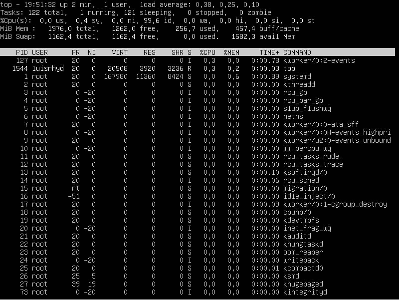  
-
    Вывод утилиты top.  

1. ***time*** текущиее время 
2. ***up*** (uptime) время роботы после загрузки 
3. ***user*** количество текущих пользователей в компьютерной системе
4. ***load average*** средняя загрузка центрального процессора
5. ***Tasks*** общее кол-во процессов
6. ***%CPU(s)*** загрузка цпу
7. ***Mib*** загрузка пямяти
8. pid процесса занимающего больше всего памяти, нажать **M** (верхняя строчка)
9. pid процесса, занимающего больше всего процессорного времени, нажать **P** (верхняя строчка)
-
    Вывод утилиты htop
    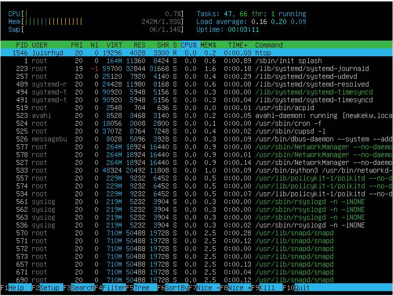 
-
    Сортировка.  

1. **PID**  

    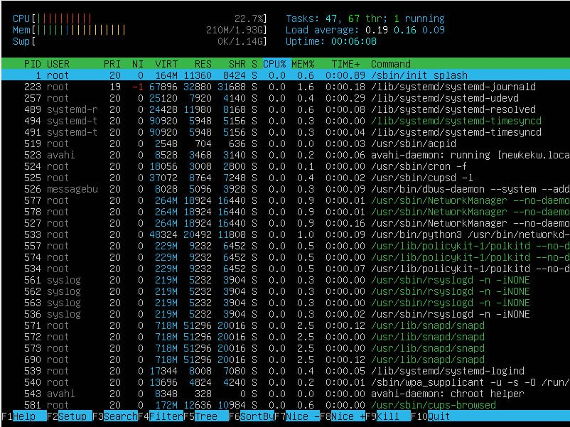 

2. **PERCENT_CPU**

    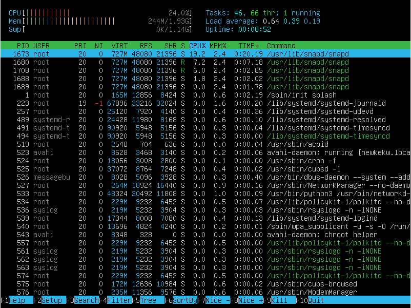 

3. **PERCENT_MEM**

    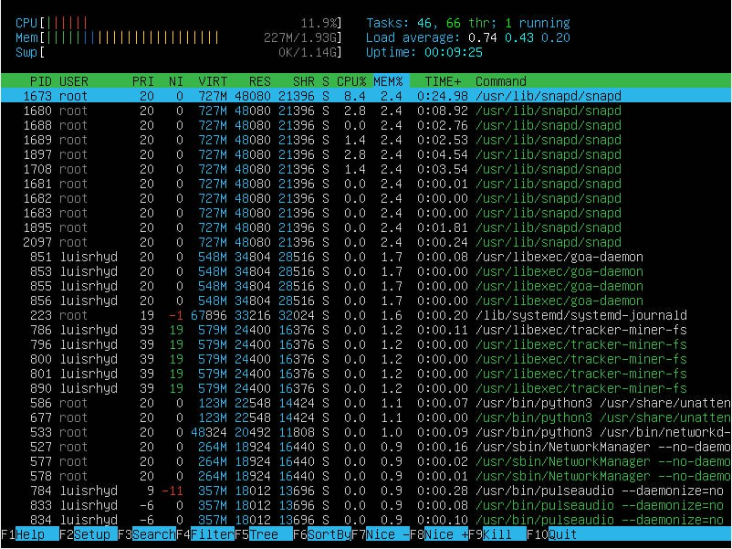

4. **TIME**

    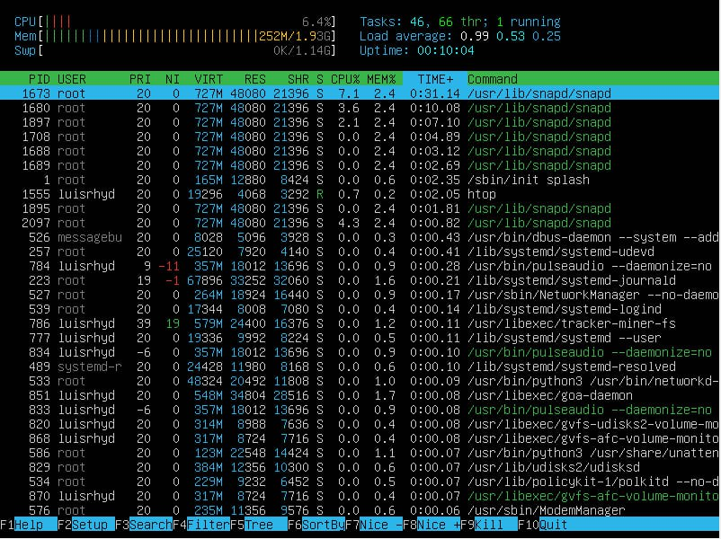
-
    Отфильтрованному для процесса sshd.
    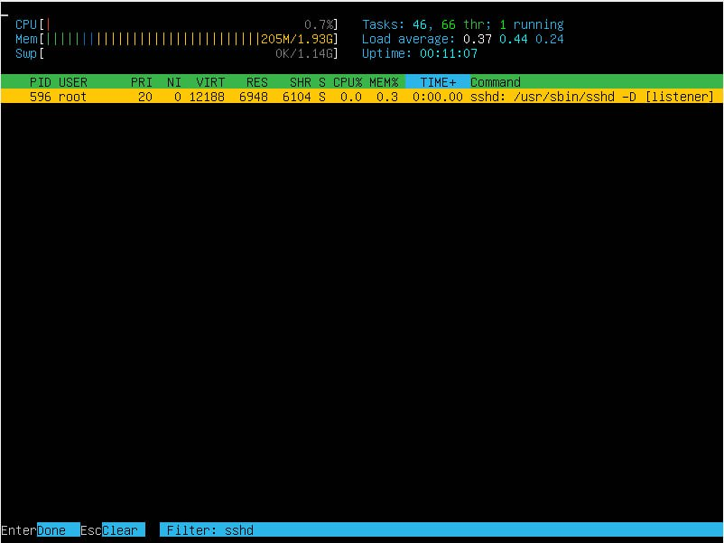
-
    C процессом syslog, найденным, используя поиск
    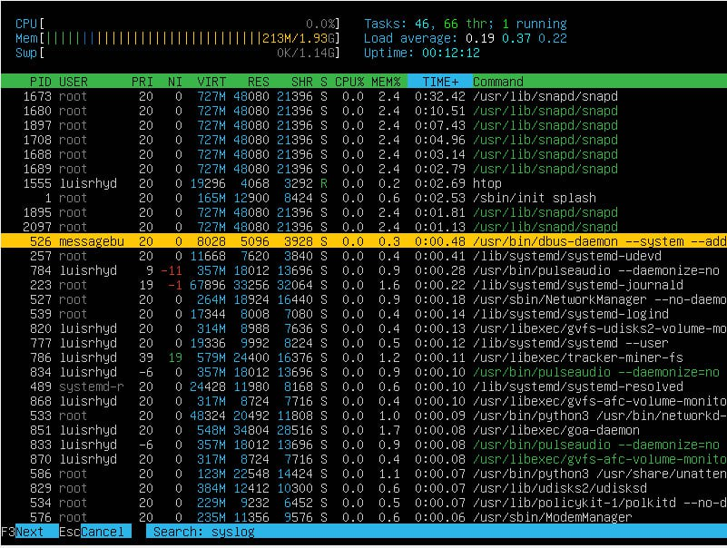
-
    С добавленным выводом hostname, clock и uptime.
    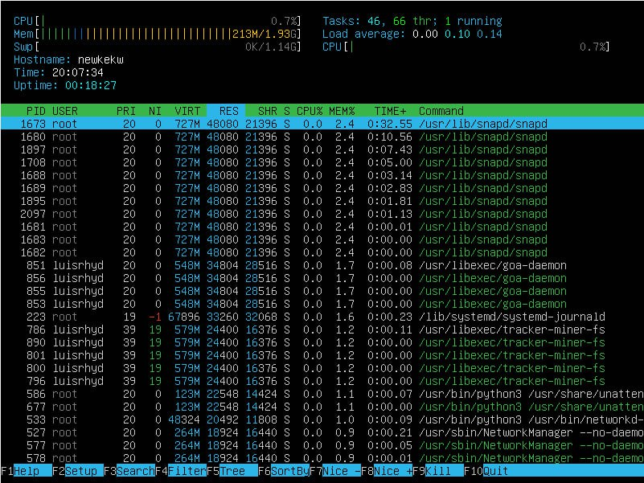

### Part-10-использование-утилиты-fdisk  
-
    Запустить команду fdisk -l.  

1. Название диска и его характеристики 

    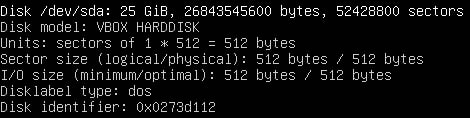

### Part-11-использование-утилиты-df  
-
    Запустить команду df.  
    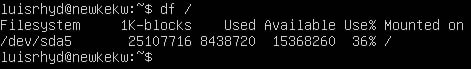

1. Размер раздела : 25107716  
2. Размер занятого пространства : 8438720  
3. Размер свободного пространства : 15368260  
4. Процент использования : 36
5. Еденица измерения в выводе : килобайт  
-
    Запустить команду df -Th.
    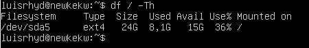  

1. Размер раздела : 24
2. Размера занятого пространства: 8.1
3. Размер свободного пространства : 15
4. Процент использования : 36
5. Тип файловой системы для раздела : ext4  

### Part-12-использование-утилиты-du  
-
    Запустить команду du.
    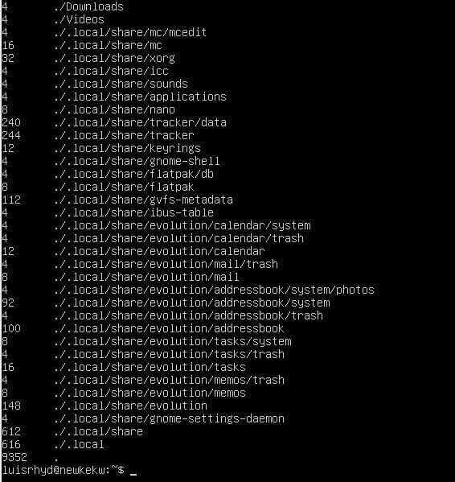  
-
    Вывести размер папок /home, /var, /var/log (в байтах, в человекочитаемом виде)
    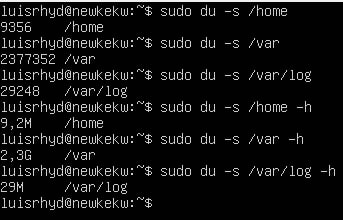 
-
    Вывести размер всего содержимого в /var/log (не общее, а каждого вложенного элемента, используя *)
    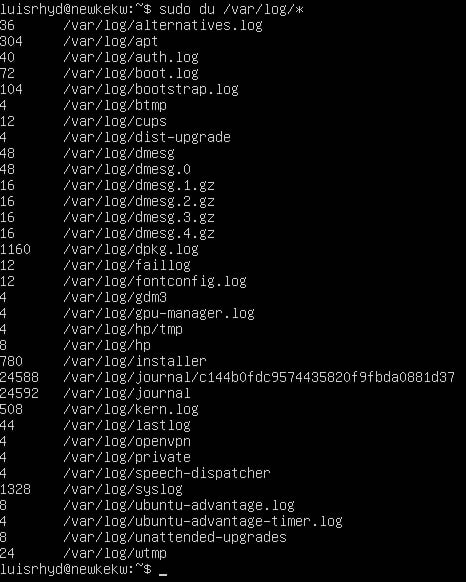  

### Part-13-установка-и-использование-утилиты-ncdu  
-
    Установить утилиту ncdu.

1. **sudo apt install ncdu**  
-
    Вывести размер папок /home, /var, /var/log.

1. ***/home***

    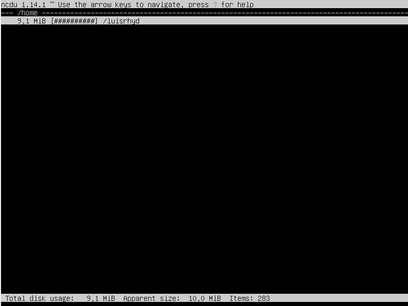  

2. ***/var***

    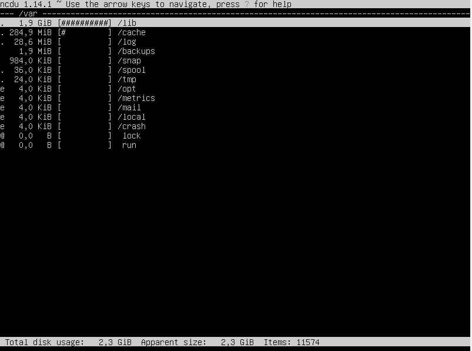  

3. ***/var/log***

    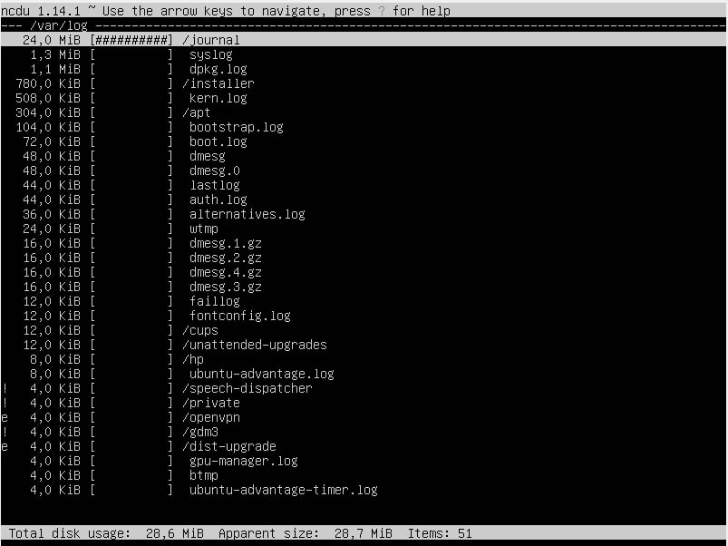  

### Part-14-работа-с-системными-журналами
-
    Открыть для просмотра:

1. /var/log/dmesg

2. /var/log/syslog

3. /var/log/auth.log

Открыть файлы можно через текстовые редакторы  

-
    Написать в отчёте время последней успешной авторизации, имя пользователя и метод входа в систему.

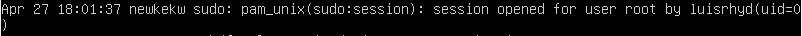 

**Время последней успешной авторизации 23:55:20 имя пользователя ***tamekiaw*** метод входа в систему ssh2**

-
    Перезапустить службу SSHd.

1. Перзапускае **sudo systemctl restart ssh** 

    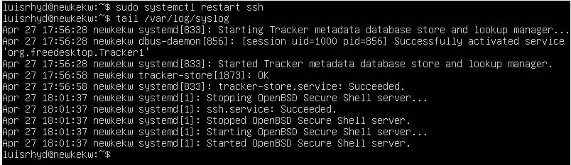

### Part-15-использование-планировщика-заданий-cron
-
    Используя планировщик заданий, запустите команду uptime через каждые 2 минуты.

1. Командой **crontab -e** ставим задачу
2. Найти в системных журналах строчки (минимум две в заданном временном диапазоне) о выполнении.

    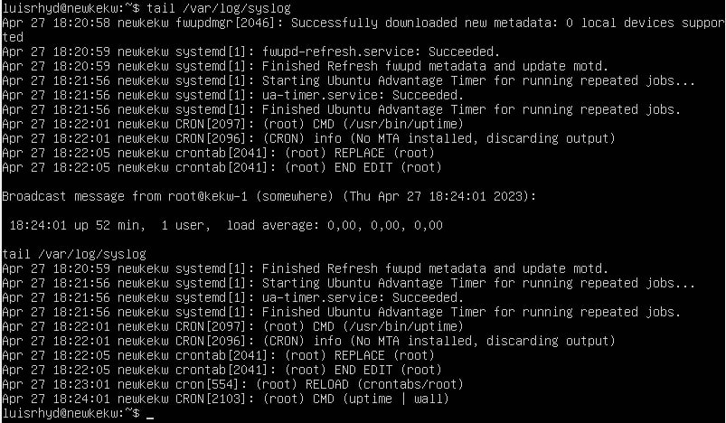

3. Вывести на экран список текущих заданий для CRON.

    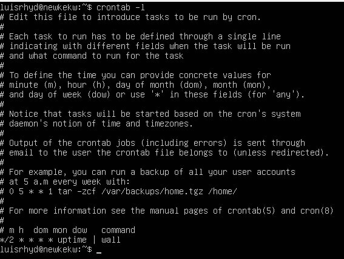

4. Удалите все задания из планировщика заданий.

    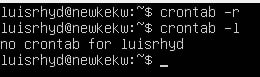

