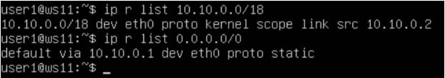
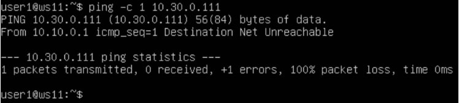

# Linux Network

1. [ipcalc tool](#ipcalc-tool)
2. [Static routing between two machines](#part-2-static-routing-between-two-machines)
3. [iperf3 utility](#part-3-iperf3-utility)
4. [Network firewall](#part-4-network-firewall)
5. [Static network routing](#part-5-static-network-routing)
6. [Dynamic IP configuration using DHCP](#part-6-dynamic-ip-configuration-using-dhcp)
7. [NAT](#part-7-nat)

## Part 1. **ipcalc** tool

#### 1.1. Сети и маски

##### Определить и записать в отчёт:

##### 1) Адрес сети *192.167.38.54/13*
- 192.160.0.0

##### 2) Перевод маски *255.255.255.0* в префиксную и двоичную запись, */15* в обычную и двоичную, *11111111.11111111.11111111.11110000* в обычную и префиксную
- */24*
- *11111111.11111111.11111111.00000000*
- *255.254.0.0*
- *11111111.11111110.00000000.00000000*
- *255.255.255.240*
- */28*

    

##### 3) Минимальный и максимальный хост в сети *12.167.38.4* при масках: */8*, *11111111.11111111.00000000.00000000*, *255.255.254.0* и */4*
- HostMin *12.0.0.1* HostMax *12.255.255.254*
- HostMin *12.167.0.1* HostMax *12.167.255.254*
- HostMin *12.167.38.1* HostMax *12.167.39.254*
- HostMin *0.0.0.1* HostMax *15.255.255.254*

    
    

#### 1.2. localhost
##### Определить и записать в отчёт, можно ли обратиться к приложению, работающему на localhost, со следующими IP: *194.34.23.100*, *127.0.0.2*, *127.1.0.1*, *128.0.0.1*
- *127.0.0.2*, *127.1.0.1* - возможно Loopback
- *194.34.23.100*, *128.0.0.1* - не возможно

    


#### 1.3. Диапазоны и сегменты сетей
##### Определить и записать в отчёт:
##### 1) какие из перечисленных IP можно использовать в качестве публичного, а какие только в качестве частных: *10.0.0.45*, *134.43.0.2*, *192.168.4.2*, *172.20.250.4*, *172.0.2.1*, *192.172.0.1*, *172.68.0.2*, *172.16.255.255*, *10.10.10.10*, *192.169.168.1*
- приватные:
    - *10.0.0.45*
    - *192.168.4.2*
    - *172.20.250.4*
    - *172.16.255.255*
    - *10.10.10.10*
- публичные:
    - *134.43.0.2*
    - *172.0.2.1*
    - *192.172.0.1*
    - *172.68.0.2*
    - *192.169.168.1*

    

##### 2) какие из перечисленных IP адресов шлюза возможны у сети *10.10.0.0/18*?
- возможны:
    - *10.10.0.2*, *10.10.10.10*, *10.10.1.255*
- не возможны:
    - *10.0.0.1*, *10.10.100.1*

####[Вернуться к оглавлению](#linux-network)

## Part 2. Static routing between two machines

##### С помощью команды `ip a` посмотреть существующие сетевые интерфейсы
- В отчёт поместить скрин с вызовом и выводом использованной команды.

  *Вызов и вывод команды `ip a` для ws1*

    

  *Вызов и вывод команды `ip a` для ws2*

    

##### Задать на обеих машинах следующие адреса и маски: ws1 - *192.168.100.10*, маска */16*, ws2 - *172.24.116.8*, маска */12*
- В отчёт поместить скрины с содержанием изменённого файла *etc/netplan/00-installer-config.yaml* с вызовом и выводом команды `netplan apply` для каждой машины.

  *Измененный файл для ws1 с вызовом и выводом команды `netplan apply`*

    
    

  *Измененный файл для ws2 с вызовом и выводом команды `netplan apply`*
  
    
    
  

Конфигурация Netplan описывается при помощи специального языка разметки YAML, ключевой особенностью которого является использование отступов для формирования структуры полей, поэтому сразу забудьте о табуляции, правилами хорошего тона является использование двух или четырех пробелов.

Структура YAML файла состоит из полей и их значений, которые отделяются двоеточием, в качестве значения могут выступать числа, строки, списки или другие поля. Все конфигурационные файлы Netplan хранятся в директории /etc/netplan, имя файла может быть любым, обязательно расширение .yaml, если файлов несколько, то они обрабатываются в алфавитном порядке. Это важный момент если у вас в разных файлах описаны зависящие друг от друга настройки, скажем, основного интерфейса и туннеля через него.


#### 2.1. Добавление статического маршрута вручную
##### Добавить статический маршрут от одной машины до другой и обратно при помощи команды вида `ip r add`
##### Пропинговать соединение между машинами
- В отчёт поместить скрин с вызовом и выводом использованных команд.

  команда `sudo ip r add 172.24.116.8 dev enp0s3` 

  *`ping` ws1 -> ws2*
  
    

  команда `sudo ip r add 192.168.100.10 dev enp0s3`

  *`ping` ws2 -> ws1*
  
    

#### 2.2. Добавление статического маршрута с сохранением
##### Перезапустить машины
##### Добавить статический маршрут от одной машины до другой с помощью файла *etc/netplan/00-installer-config.yaml* Пропинговать соединение между машинами
- В отчёт поместить скрин с содержанием изменённого файла *etc/netplan/00-installer-config.yaml* и вызовом и выводом использованной команды.

  *Добавление статического маршрута + `ping` ws1 -> ws2*

    

    

  *Добавление статического маршрута + `ping` ws2 -> ws1*
  
    

    

Первое поле указывает, что мы настраиваем сеть, далее указывается версия YAML и рендер, т.е. какой сетевой менеджер будет использоваться, если эта опция не указана, то подразумевается networkd, хотя мы советуем указывать ее явно. Альтернативным значением является NetworkManager, обратите внимание на регистр написания.

Поле ethernets содержит настройки проводных интерфейсов, в качестве значений выступают поля с именами интерфейсов, которые содержат поля с настройками. Для включения DHCP по протоколу IPv4 используется опция dhcp4, в которой можно указать как true/false, так и yes/no.

##### Настройка статического IP-адреса.
В поле dchp4 прописываем значение false, так как мы не используем DHCP. Поле addresses подразумевает список значений, которые заключаются в квадратные скобки и перечисляются через запятую, скобки обязательны, даже если значение одно. (Также можно использовать и альтернативный вариант синтаксиса) Формат записи IP-адреса: адрес/префикс, префикс /24 соответствует маске 255.255.255.0.

Для указания шлюза служит поле gateway4, а для настройки DNS - nameservers, которое содержит вложенные поля, мы должны указать как минимум одно, с адресами DNS-серверов.

Если требуется указать несколько IP-адресов для одного интерфейса, то запись будет выглядеть так:
`addresses: [192.168.233.154/24, 192.168.1.154/24] `
или
`addresses:`
`- 192.168.233.154/24`
`- 192.168.1.154/24`

####[Вернуться к оглавлению](#linux-network)

## Part 3. **iperf3** utility

#### 3.1. Скорость соединения
Консольная утилита iperf3 предназначена для того, чтобы измерять пропускную способность сети. Она поддерживает работу как по протоколу TCP, так и по UDP. Для проведения тестирования надо запустить iperf3 как на сервере, так и на клиенте. Клиентская часть будет генерировать трафик, а серверная - принимать и отбрасывать.
##### Перевести и записать в отчёт: 8 Mbps в MB/s, 100 MB/s в Kbps, 1 Gbps в Mbps
- 8 Mbps = 1 MB/s
- 100 MB/s = 819200 Kbps
- 1 Gbps = 1024 Mbps


#### 3.2. Утилита **iperf3**
##### Измерить скорость соединения между ws1 и ws2
- В отчёт поместить скрины с вызовом и выводом использованных команд.

  *Запуск с помощью команды `iperf3 -s -D` серверной части утилиты iperf3 в фоновом режиме, проверка работы сервера `ss -tulpn | grep 5201`. Либо `iperf -s`.*

    

  *Запуск клиентской части утилиты `iperf3 -f K`, по умолчанию тестирование идет 10 сек. Либой `iperf3 -c 192.168.100.10`*
  
    

####[Вернуться к оглавлению](#linux-network)

## Part 4. Network firewall

#### 4.1. Утилита **iptables**

Утилита `iptables` служит для проверки сетевых пакетов. В фильтре `iptables` все пакеты делятся на три основные цепочки:
- input - обрабатывает входящие пакеты и подключения
- forward - применяется для проходящих соединений
- output - используется для исходящих пакетов и соединений
  а также существуют две вспомогательные:
- prerouting - в эту цепочку пакет попадает перед обработкой iptables, система еще не знает куда он будет отправлен, в input, output или forward;
- postrouting - сюда попадают все проходящие пакеты, которые уже прошли цепочку forward.

Для каждого типа пакетов можно установить набор правил, которые по очереди будут проверяться на соответствие с пакетом и если пакет соответствует, то применять к нему указанное в правиле действие. Правила образуют цепочку, поэтому input, output и forward называют цепочками, цепочками правил. Действий может быть несколько:

- **ACCEPT** - разрешить прохождение пакета дальше по цепочке правил;
- **DROP** - удалить пакет;
- **REJECT** - отклонить пакет, отправителю будет отправлено сообщение, что пакет был отклонен;
- **LOG** - сделать запись о пакете в лог файл;
- **QUEUE** - отправить пакет пользовательскому приложению.

Над цепочками правил в iptables есть еще один уровень абстракции, и это таблицы. В системе есть несколько таблиц, и все они имеют стандартный набор цепочек input, forward и output. Таблицы предназначены для выполнения разных действий над пакетами, например для модификации или фильтрации.

- **raw** - предназначена для работы с сырыми пакетами, пока они еще не прошли обработку;
- **mangle** - предназначена для модификации пакетов;
- **nat** - обеспечивает работу nat, если вы хотите использовать компьютер в качестве маршрутизатора;
- **filter** - основная таблица для фильтрации пакетов, используется по умолчанию.


##### Создать файл */etc/firewall.sh*, имитирующий фаерволл, на ws1 и ws2 и добавить в него подряд следующие правила:
1. на ws1 применить стратегию когда в начале пишется запрещающее правило, а в конце пишется разрешающее правило (это касается пунктов 4 и 5)
2. на ws2 применить стратегию когда в начале пишется разрешающее правило, а в конце пишется запрещающее правило (это касается пунктов 4 и 5)
3. открыть на машинах доступ для порта 22 (ssh) и порта 80 (http)
4. запретить *echo reply* (машина не должна "пинговаться”, т.е. должна быть блокировка на OUTPUT)
5. разрешить *echo reply* (машина должна "пинговаться")


##### Запустить файлы на обеих машинах командами `chmod +x /etc/firewall.sh` и `/etc/firewall.sh`
- В отчёт поместить скрины с запуском обоих файлов и с содержанием файла */etc/firewall* для каждой машины.
  
  *Содержание файла /etc/firewall и запуск `chmod +x /etc/firewall.sh` и `/etc/firewall.sh` для ws1.*

    
    

  *Содержание файла /etc/firewall и запуск `chmod +x /etc/firewall.sh` и `/etc/firewall.sh` для ws2.*

    
    

  В отчёте описать разницу между стратегиями, применёнными в первом и втором файлах.
  - Так как утилита iptabels выполняет первое прочитанное правило, разница между стратегиями заключается в порядке команд. Для машины ws1 первой стоит команда **DROP** - удалить пакет. Будет выполнятся этот запрет и пинг не пройдет. Для машины ws2 напротив, первым стоит **ACCEPT** - разрешить прохождение пакета. Пинг проходит.

  

#### 4.2. Утилита **nmap**
##### Командой **ping** найти машину, которая не "пингуется", после чего утилитой **nmap** показать, что хост машины запущен
*Проверка: в выводе nmap должно быть сказано: `Host is up`*

- В отчёт поместить скрины с вызовом и выводом использованных команд **ping** и **nmap**.

    

  *Команда `ping` и запуск утилиты`nmap` для ws2, т.к. ws1 теперь не пингуется из-за firewall.sh*

####[Вернуться к оглавлению](#linux-network)

## Part 5. Static network routing

##### Поднять пять виртуальных машин (3 рабочие станции (ws11, ws21, ws22) и 2 роутера (r1, r2))

#### 5.1. Настройка адресов машин
##### Настроить конфигурации машин в *etc/netplan/00-installer-config.yaml* согласно сети на рисунке.
- В отчёт поместить скрины с содержанием файла *etc/netplan/00-installer-config.yaml* для каждой машины.
  
  *Конфигурационный файл для `r1`.*

    
  
  *Конфигурационный файл для `r2`.*

    
  
  *Конфигурационный файл для `ws11`.*
  
    
  
  *Конфигурационный файл для `ws21`.*
  
    
  
  *Конфигурационный файл для `ws22`.*
  
    
  
  

##### Перезапустить сервис сети. Если ошибок нет, то командой `ip -4 a` проверить, что адрес машины задан верно. Также пропинговать ws22 с ws21. Аналогично пропинговать r1 с ws11.

- В отчёт поместить скрины с вызовом и выводом использованных команд.

    *`ip -4 a` для `r1`*
  
    

    *`ip -4 a` для `r2`*

    

    *`ip -4 a` для `ws11`*

    

    *`ip -4 a` для `ws21`*

    

    *`ip -4 a` для `ws22`*

    

    *Пинг `ws22` -> `ws21`.*

    
  
    *Пинг `r1` -> `ws11`.*
    
    
  

#### 5.2. Включение переадресации IP-адресов.

##### Для включения переадресации IP, выполните команду на роутерах:

`sysctl -w net.ipv4.ip_forward=1`

*При таком подходе переадресация не будет работать после перезагрузки системы.*

##### Откройте файл */etc/sysctl.conf* и добавьте в него следующую строку:

`net.ipv4.ip_forward = 1`

*При использовании этого подхода, IP-переадресация включена на постоянной основе.*
 
- В отчёт поместить скрин с вызовом и выводом команды `sysctl -w net.ipv4.ip_forward=1` и с содержанием изменённого файла */etc/sysctl.conf*.

    *Команда `sysctl -w net.ipv4.ip_forward=1` и содержание файла /etc/sysctl.conf для `r1`.*
  
    
  
    *Команда `sysctl -w net.ipv4.ip_forward=1` и содержание файла /etc/sysctl.conf для `r2`.*
  
    
  
  
#### 5.3. Установка маршрута по-умолчанию

Пример вывода команды `ip r` после добавления шлюза:

```
default via 10.10.0.1 dev eth0
10.10.0.0/18 dev eth0 proto kernel scope link src 10.10.0.2
```

##### Настроить маршрут по-умолчанию (шлюз) для рабочих станций. Для этого добавить `default` перед IP роутера в файле конфигураций. Вызвать `ip r` и показать, что добавился маршрут в таблицу маршрутизации

- В отчёт поместить скрин с вызовом и выводом использованной команды и скрин с содержанием файла *etc/netplan/00-installer-config.yaml*.

    *Команда `ip r` и содержание файла etc/netplan/00-installer-config.yaml для `ws11`.*
  
    

    
  
    *Команда `ip r` и содержание файла etc/netplan/00-installer-config.yaml для `ws21`.*
  
    

    
  
    *Команда `ip r` и содержание файла etc/netplan/00-installer-config.yaml для `ws22`.*
  
    

    


##### Пропинговать с ws11 роутер r2 и показать на r2, что пинг доходит. Для этого использовать команду:

`tcpdump -tn -i eth1`
 
- В отчёт поместить скрин с вызовом и выводом команды.

    *Вывод команды `tcpdump -tn -i eth1`, пинг `ws11 -> r2` проходит.*
  
    
  
    

  
#### 5.4. Добавление статических маршрутов

##### Добавить в роутеры r1 и r2 статические маршруты в файле конфигураций. Пример для r1 маршрута в сетку 10.20.0.0/26:

```shell
# Добавить в конец описания сетевого интерфейса eth1:
- to: 10.20.0.0
  via: 10.100.0.12
```

##### Вызвать `ip r` и показать таблицы с маршрутами на обоих роутерах. Пример таблицы на r1:

```
10.100.0.0/16 dev eth1 proto kernel scope link src 10.100.0.11
10.20.0.0/26 via 10.100.0.12 dev eth1
10.10.0.0/18 dev eth0 proto kernel scope link src 10.10.0.1
```
- 
- В отчёт поместить скрины с содержанием изменённого файла *etc/netplan/00-installer-config.yaml* и скрин с вызовом и выводом использованной команды для каждого роутера.

    *Cодержание файла etc/netplan/00-installer-config.yaml и таблица маршрутизации для `r1`.*
  
    

    
  
    *Cодержание файла etc/netplan/00-installer-config.yaml и таблица маршрутизации для `r2`.*

    

    
  

##### Запустить команды на ws11:

`ip r list 10.10.0.0/18` и `ip r list 0.0.0.0/0`
- В отчёт поместить скрин с вызовом и выводом использованных команд.
  
    *Запуск команд `ip r list 10.10.0.0/18` и `ip r list 0.0.0.0/0` для`ws11`.*

    
  
 
- В отчёте объяснить, почему для адреса 10.10.0.0/18 был выбран маршрут, отличный от 0.0.0.0/0, хотя он попадает под маршрут по-умолчанию.
- При наличии двух и более маршрутов выбирается маршрут с самой длинной маской т.к. он более точный

#### 5.5. Построение списка маршрутизаторов

Пример вывода утилиты **traceroute** после добавления шлюза:

```
1 10.10.0.1 0 ms 1 ms 0 ms
2 10.100.0.12 1 ms 0 ms 1 ms
3 10.20.0.10 12 ms 1 ms 3 ms
```

##### Запустить на r1 команду дампа:

`tcpdump -tnv -i eth0`

##### При помощи утилиты **traceroute** построить список маршрутизаторов на пути от ws11 до ws21 
- В отчёт поместить скрины с вызовом и выводом использованных команд (tcpdump и traceroute).

    *Запуск команды `tcpdump -tnv -i eth0` на `r1`.*

    
  
    *Запуск команды `traceroute` на `ws11`.*
  
    
  
 
-  В отчёте, опираясь на вывод, полученный из дампа на r1, объяснить принцип работы построения пути при помощи **traceroute**.
 
- Каждый пакет проходит на своем пути определенное количество узлов, пока достигнет своей цели. Причем, каждый пакет имеет свое время жизни. Это количество узлов, которые может пройти пакет перед тем, как он будет уничтожен. Этот параметр записывается в заголовке TTL, каждый маршрутизатор, через который будет проходить пакет уменьшает его на единицу. При TTL=0 пакет уничтожается, а отправителю отсылается сообщение Time Exceeded.
  Команда traceroute linux использует UDP пакеты. Она отправляет пакет с TTL=1 и смотрит адрес ответившего узла, дальше TTL=2, TTL=3 и так пока не достигнет цели. Каждый раз отправляется по три пакета и для каждого из них измеряется время прохождения. Пакет отправляется на случайный порт, который, скорее всего, не занят. Когда утилита traceroute получает сообщение от целевого узла о том, что порт недоступен трассировка считается завершенной.

#### 5.6. Использование протокола **ICMP** при маршрутизации

##### Запустить на r1 перехват сетевого трафика, проходящего через eth0 с помощью команды:

`tcpdump -n -i eth0 icmp`

##### Пропинговать с ws11 несуществующий IP (например, *10.30.0.111*) с помощью команды:

`ping -c 1 10.30.0.111`
 
- В отчёт поместить скрин с вызовом и выводом использованных команд.

    *Запуск команды `tcpdump -n -i eth0 icmp` на `r1`.*
  
    
  
    *Запуск команды `ping -c 1 10.30.0.111` на `ws11`.*
  
    
  

####[Вернуться к оглавлению](#linux-network)

## Part 6. Dynamic IP configuration using **DHCP**

##### Для r2 настроить в файле */etc/dhcp/dhcpd.conf* конфигурацию службы **DHCP**:

##### Указать адрес маршрутизатора по-умолчанию, DNS-сервер и адрес внутренней сети. Пример файла для r2:

```shell
subnet 10.100.0.0 netmask 255.255.0.0 {}

subnet 10.20.0.0 netmask 255.255.255.192
{
    range 10.20.0.2 10.20.0.50;
    option routers 10.20.0.1;
    option domain-name-servers 10.20.0.1;
}
```

##### В файле resolv.conf прописать nameserver 8.8.8.8.
 
- В отчёт поместить скрины с содержанием изменённых файлов.

##### Перезагрузить службу DHCP командой systemctl restart isc-dhcp-server. Машину ws21 перезагрузить при помощи reboot и через ip a показать, что она получила адрес. Также пропинговать ws22 с ws21.
 
- В отчёт поместить скрины с вызовом и выводом использованных команд.

    *Измененные файлы и перезапуск `DHCP`.*
  
    

    
  
    *IP `ws21`.*
  
    
  
    *Пинг `ws21` > `ws22`.*
  
    
  

##### Указать MAC адрес у ws11, для этого в *etc/netplan/00-installer-config.yaml* надо добавить строки: `macaddress: 10:10:10:10:10:BA`, `dhcp4: true`
 
- В отчёт поместить скрин с содержанием изменённого файла *etc/netplan/00-installer-config.yaml*.

    *Cодержание изменённого файла etc/netplan/00-installer-config.yaml.*
  
    
  
    *Настройка МАС-адреса машины `ws11`*

    


##### Для r1 настроить аналогично r2, но сделать выдачу адресов с жесткой привязкой к MAC-адресу (ws11). Провести аналогичные тесты
 
- В отчёте этот пункт описать аналогично настройке для r2.

    *Измененные файлы и перезапуск `DHCP`.*
  
    
  

##### Запросить с ws21 обновление ip адреса
 
- В отчёте поместить скрины ip до и после обновления.

    *IP до обновления.*

    
  
    *IP после обновления.*

    


- В отчёте описать, какими опциями **DHCP** сервера пользовались в данном пункте.

  *dhclient -v* - получение нового ip;
  *dhclient -r* - удаление старых (всех) ip;

```shell
subnet 10.20.0.0 netmask 255.255.255.192
{
    range 10.20.0.2 10.20.0.50; - диапазон доступных IP адресов
    option routers 10.20.0.1; - адрес шлюза маршрутизатора
    option domain-name-servers 10.20.0.1; IP адресс DNS-сервера
}
```

####[Вернуться к оглавлению](#linux-network)

## Part 7. **NAT**

##### В файле */etc/apache2/ports.conf* на ws22 и r1 изменить строку `Listen 80` на `Listen 0.0.0.0:80`, то есть сделать сервер Apache2 общедоступным. Запустить веб-сервер Apache командой `service apache2 start` на ws22 и r1
- В отчёт поместить скрины с содержанием изменённого файла и с вызовом и выводом использованной команды.

    *Файл `ports.conf` и запуск сервера на `ws22`.*
  
    

    
  
    *Файл `ports.conf` и запуск сервера на `r1`.*

    
  

##### Добавить в фаервол, созданный по аналогии с фаерволом из Части 4, на r2 следующие правила:

##### 1) Удаление правил в таблице filter - `iptables -F`
##### 2) Удаление правил в таблице "NAT" - `iptables -F -t nat`
##### 3) Отбрасывать все маршрутизируемые пакеты - `iptables --policy FORWARD DROP`

##### Запускать файл также, как в Части 4
##### Проверить соединение между ws22 и r1 командой `ping`

*При запуске файла с этими правилами, ws22 не должна "пинговаться" с r1*
- В отчёт поместить скрины с вызовом и выводом использованной команды.

    *Содержание и запуск файла `firewall.sh` на `r1`.*
  
    
  
    *Ping `ws22` > `r1`.*
  
    


##### Добавить в файл ещё одно правило:
##### 4) Разрешить маршрутизацию всех пакетов протокола **ICMP**
##### Запускать файл также, как в Части 4
##### Проверить соединение между ws22 и r1 командой `ping`

*При запуске файла с этими правилами, ws22 должна "пинговаться" с r1*
 
- В отчёт поместить скрины с вызовом и выводом использованной команды.

    *Содержание и запуск файла `firewall.sh` на `r2`.*
  
    
  
    *Ping `r1` > `ws22`.*
  
    
  

##### Добавить в файл ещё два правила:
##### 5) Включить **SNAT**, а именно маскирование всех локальных ip из локальной сети, находящейся за r2 (по обозначениям из Части 5 - сеть 10.20.0.0)
*Совет: стоит подумать о маршрутизации внутренних пакетов, а также внешних пакетов с установленным соединением*

##### 6) Включить **DNAT** на 8080 порт машины r2 и добавить к веб-серверу Apache, запущенному на ws22, доступ извне сети
*Совет: стоит учесть, что при попытке подключения возникнет новое tcp-соединение, предназначенное ws22 и 80 порту*
 
- В отчёт поместить скрин с содержанием изменённого файла.
  
    


##### Проверить соединение по TCP для **SNAT**, для этого с ws22 подключиться к серверу Apache на r1 командой:
`telnet [адрес] [порт]`

##### Проверить соединение по TCP для **DNAT**, для этого с r1 подключиться к серверу Apache на ws22 командой `telnet` (обращаться по адресу r2 и порту 8080)
- В отчёт поместить скрины с вызовом и выводом использованных команд.

    *`telnet ws22` > `r1`.*
  
    
  
    *`telnet ws22` > `r1`.*
  
    
  

####[Вернуться к оглавлению](#linux-network)